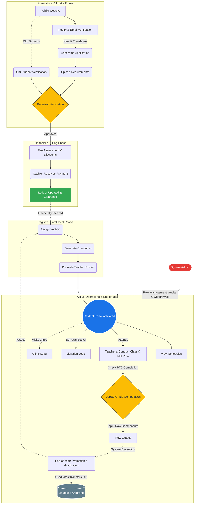
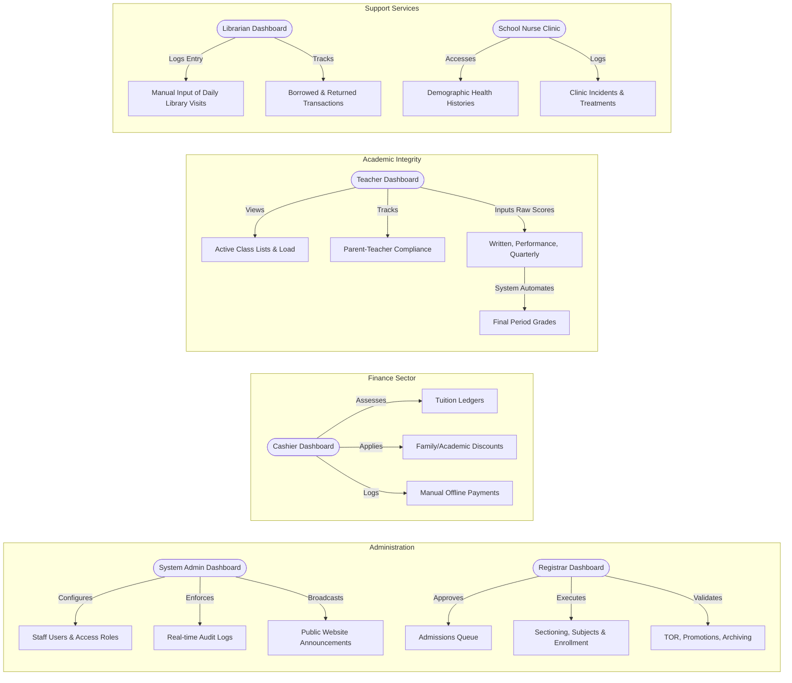
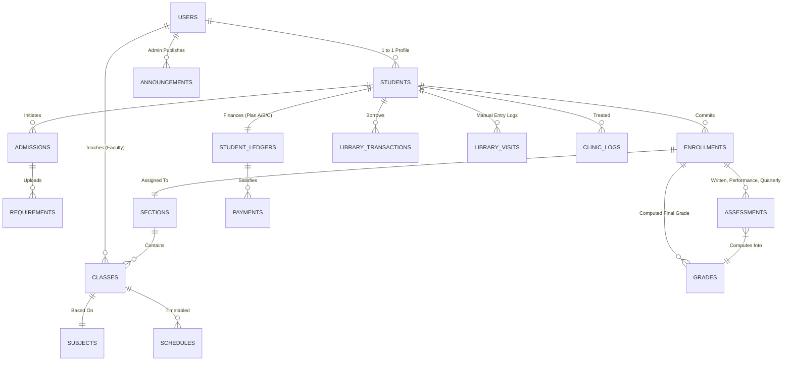

# Master Systems Document
**Agnus Dei School Systems, Inc. - Centralized ERP Project**

This document serves as the formal architectural and operational blueprint for the Agnus Dei ERP System. It is structured to provide clear requirements for your Capstone defense.

---

## I. Institutional Identity & Core Values

### School Vision
Capacitating the youth to develop the 21st Century skills with the fusion of character formation and intellectual integrity to meet the challenges ahead.

### School Mission
The School commits its resources, time, and best efforts of the Administration, faculty, and staff to provide affordable good quality education, to develop strong Christian faith, and to make the curriculum instructions timelier, and more relevant in order to deepen the civic and spiritual consciousness of every learner.

### Goals and Objectives
1. To provide the basic knowledge and foundation in developing the cognitive, effective, and psychomotor skills, attitudes, and values, including their moral and spiritual dimensions essential to the child's personal development and necessary for living and contributing to a developing and changing social environment.
2. To provide the learning experiences that enhance the child's awareness of and responsiveness to the changes in society and to prepare for constructive and effective involvement.
3. To promote and intensify the child's knowledge of identification with and love for country and people to which he belongs.
4. To develop the child's knowledge, love, and care for the environment.
5. To develop his awareness of the interconnectivity of peoples around the world and their living together in one wide world, thereby creating in the child the tolerance of cultural diversity and the strong desire to contribute to this world's development.
6. To promote work experiences which develop and enhance the child's orientation to the world of work and creativity in order to prepare him to engage in honest and gainful work.
7. To enhance his mastery in the use of tools and technology and his aptitude to innovate as a means of increasing his productivity.
8. To develop the child's different aptitudes, interests, and skills to prepare him for real work and/or for further formal studies in higher education.
9. To help the child realize that in the pursuit of education he seeks to glorify and serve GOD.
10. To contribute to the evangelization efforts of the Church.

### Core Values (RISE UP)
* **R** - esiliency and Adaptability
* **I** - industry and Integrity
* **S** - ocial Transformation
* **E** - mpathy and Emotional Intelligence
* **U** - pskilling and reskilling 
* **P** - roactive Orientation

### 21st Century Skills (The 8 C's)
* Critical Thinking
* Collaboration
* Communication
* Creativity
* Concern for the Environment 
* Computing ICT Literacy
* Career and Learning Self-Reliance 
* Cross Cultural Understanding

---

## II. Institutional Policies, Rules, and Regulations

### A. Admission Policies and Requirements
**1. New Students (from Kinder to Senior HS)**
* **1.1 AGE**
  * 1.1.1. Kinder 1 - 4 years old by the opening of the school year 
  * 1.1.2. Kinder 2 - 5 years old by the opening of the school year 
  * 1.1.3. Grade 1 - 6 years old by the opening of the school year 
* **1.2 Certification:** Certification from the Kindergarten school last attended (for entering Grade 1). All other entrants to Grade 1 who came from other schools shall undergo a Read-Aloud Exercise and physical initial interview.
* **1.3 Form 138:** Certified true copy of the latest Form 138 (Report Card).
* **1.4 Birth Certificate:** PSA-authenticated (for new enrollees).
* **1.5 Certificate of Good Moral Character:** Duly signed by the Principal of the school last attended.
* **1.6 Pictures:** Two (2) 2x2 colored ID pictures with white background.
* **1.7 Interviews:** Incoming Junior High School students who came from other public/private schools and other transferees shall undergo interviews conducted by the JHS Department Coordinator and/or School Head.
* **1.8 Forms:** Accomplished Student Data Form and Parent Data Form.

**Additional Requirements for SHS Entrants**
* **1.10 JHS Graduates from ESC-Certified Private Schools:** ESC Grant Certificate.
* **1.11 JHS Graduates from Non-ESC-Certified Private Schools:** SHS Voucher.

**2. Old Students**
* **2.1** Form 138 (Report Card)

**B. Admission Procedure**
1. Fill up an application form and submit the same to the teacher-in-charge of admission, together with all other essential documents and requirements.
2. New enrollees and transferees shall be interviewed by the teacher-in-charge of admission for initial assessment. Review of grades in Form 138 shall be undertaken as well.
3. Pay the necessary fees to be officially enrolled.
4. Must attend the orientation activity before the opening of classes to become fully informed of the prevailing policies of the School.

**C. Curriculum Year Level**
Only students with no failing marks and a general average of 75% more are eligible for readmission to the next year level. In some instances, students who do not meet the required general average may be readmitted under academic probation in the school year under the following circumstances:
1. They have taken remedial classes during the preceding summer and have passed the same.
2. They do not have behavioral/disciplinary records.

### B. Academic & Grading Policies

**1. Automated Grading Components (DepEd Standard)**
Academic excellence shall be based on the general average the student got from Written Work, Performance Tasks, and Quarterly Assessment. These three areas are given specific percentage weights that vary according to the nature of the learning area.

**Table 1. Weight of the Components for Grades 1 – 10**
| Components | Languages / AP / ESP | Science / Math | MAPEH / EPP / TLE |
| :--- | :---: | :---: | :---: |
| **Written Work** | 30% | 40% | 40% |
| **Performance Task** | 50% | 40% | 40% |
| **Quarterly Assessment** | 20% | 20% | 20% |

**Table 2. Weight of the Components for SHS (Grades 11 – 12)**
| Components | Core Subjects | Academic Track: All Other Subjects | Academic Track: Work Immersion / Research | TVL / Sports / Arts & Design Track |
| :--- | :---: | :---: | :---: | :---: |
| **Written Work** | 25% | 25% | 35% | 20% |
| **Performance Task** | 50% | 45% | 40% | 60% |
| **Quarterly Assessment** | 25% | 30% | 25% | 20% |

**2. Recognition of Merit / Selection of Honor Students**
* **C.1.** Candidates for honors in all levels shall have no grade lower than 87% in any subject. The top five achievers of each curriculum level will be recognized at the end of each quarter. Rankings for the top five (5) achievers will not be announced until the last quarter of the school term. 
* **C.2.** To qualify for honors, a student must not have any major derogatory record or violate school policies.
* **C.3.** The top five (5) achievers shall be ranked using the **7-3 Point Scheme** (7 points for Academic Performance and 3 points for Co-curricular Activities).
* **C.5.** In the final ranking (Refer to DepEd Order No. 8, s. 2015):
  * **98-100**: Highest Honor
  * **95-97**: High Honor
  * **90-94**: With Honor

### C. Financial Policies
It is deemed that once a student is enrolled, a commitment is made for the whole school year. 

**1. Schedule of Payments**
* **Plan A (Cash):** All fees are paid upon enrollment. A ten (10%) percent discount in tuition fees is granted.
* **Plan B (Monthly):** Upon enrollment, Php 1,500 + registration and miscellaneous fees. The balance is divided into months and must be fully settled before the end of the school year.
* **Plan C (Alternative Plan):** Crafted via a meeting with the parent, cashier, and registrar due to unforeseeable circumstances affecting regular payment.

**2. Withdrawal and Refunds**
A student withdrawing after the fourth week of classes will be charged the tuition fees for the entire school year. No official clearance will be released unless accounts are paid. Refunds are based on:
* Before the first week of classes: 100%
* After a week of classes: 90%
* After the second week of classes: 80% 
* After the third week of classes: 70%
* After the fourth week of classes: 0% *(There are no refunds under Plan B).*

**3. Scholarships and Privileges & Discount**
* **Honors Program:** Grade 6 Rank 1 receives **100% discount**, Rank 2 receives **50% discount**, Rank 3 receives **25% discount**. JHS Students (Grades 7 to 10): Rank 1 (**100%**), Rank 2 (**75%**), Rank 3 (**50%**).
* **Family Discount:** Enrolling multiple children grants a 10% discount to the second child, and a 15% discount to the third child.
* **ESC Grant:** Php 9,000 for qualifying Grade 7 students, released at the latter part of the term (not applicable at enrollment).

---

## III. System Architecture & Security Standards

To ensure the system is secure and compliant with institutional rules and the **Data Privacy Act of 2012 (RA 10173)**, the following technical constraints are enforced:

* **Scope Control (Offline Ledger):** The ERP restricts payment processing exclusively to physical, face-to-face transactions per the Financial Policies. The system securely acts as a digital ledger.
* **Unified Account Proxy:** Students and Parents share a single, unified Portal Account to simplify access and track the monthly financial statements (Plan B).
* **Password Hashing:** All system passwords are computationally hashed using Laravel’s Bcrypt algorithm.
* **Middleware Routing:** Strict Role-Based Access Control (RBAC) ensures isolated dashboard views.
* **Data Archiving:** Sensitive demographics and medical logs are securely retained rather than permanently deleted, fulfilling legal data retention policies.

---

## IV. Core Operational Workflow (Step-by-Step)

### Phase 1: Pre-Admission & Inquiry
1. **Public Engagement:** Prospective students explore programs, admission policies, and view **Public Announcements** published by the Admin.
2. **Student Number Generation:** Upon identity verification, the applicant receives a strict Institutional Student Number (`[EnrollmentYear]-[UniqueID]`, e.g., `2026-00123`). 

### Phase 2: Application Phase
3. **Admission Application:** The applicant completes their primary profile, fulfilling all age requirements (e.g., K1 = 4 years old).
4. **Requirements Upload:** Secure digital uploading of Birth Certificates, Form 138, and Good Moral profiles.
5. **Registrar Approval:** The Registrar verifies submitted documents. Automated email notifications clear the student for the Finance gate.

### Phase 3: Financial & Enrollment Phase
6. **Tuition Assessment:** The system computes the grade-level fee, prompting the user for **Plan A, Plan B, or Plan C**, and automatically applying honors or family discounts.
7. **Payment Processing:** The Cashier logs the physical payment. This triggers an automated digital receipt and flags the student as "Financially Cleared."
8. **Enrollment & Sectioning:** The Registrar officially categorizes the student: assigning sections and required curriculum subjects.

### Phase 4: Active Student Ecosystem
9. **Portal Activation:** The unified Student/Parent account unlocks to view Class Schedules, monitor pending balances, and track academic grades.

### Phase 5: End of Term & Progression
10. **Promotion Processing:** Upon checking constraints (no failing marks, >75% GWA), students are staged for promotion. The **7-3 Point Scheme** evaluates the top achievers.
11. **Graduation Clearance:** Automated clearance checks against the Cashier and Librarian ledgers ensure no "Back Accounts" exist. 

### 🗺️ Full Operational Flowchart

---

## V. Cross-Functional Process Flows

* **Old Student Registration:** Returning students bypass document uploads. They input their legacy LRN, update contact info, and await evaluation for legacy holds before proceeding to Payment.
* **Cashier Process:** Applies Plan A/B/C payment terms, evaluates manual discounts, inputs over-the-counter payments and automatically blocks non-paying students (Back Accounts) from taking the Monthly/Periodical tests.
* **Teacher Process:** Teachers instruct students and log PTC compliance. When grading opens, Teachers input raw scores based strictly on the DepEd components (**Written Work, Performance Tasks, Quarterly Assessments**). Grade finalization is blocked for students flagged as non-PTC compliant or those holding Back Accounts.
* **Librarian Process:** The Librarian **manually inputs** a student's institutional Student Number to log their daily facility usage and to trace borrowed books.
* **School Nurse Process:** Access demographic profiles to log clinic incident dates, symptoms, and provided treatments.
* **System Admin Process:** Creates users, enforces access roles, captures audit trails, and publishes **Announcements.**

---

## VI. Role-Based Dashboards (RBAC Specific Views)

The ERP enforces strict Role-Based Access Control (RBAC) via Laravel Middleware:

### 1. System Admin Dashboard
* **Website Management:** Toggles to draft and publish Announcements directly to the Public Website.
* **Global Controls:** Toggles for sweeping academic events.
* **User Management:** Create/suspend dashboards for institutional staff.
* **Audit Trails:** Real-time stream tracking system modifications.

### 2. Registrar Dashboard
* **Admissions Queue:** Tool for reviewing New/Old applications and verifying document legality (Age rules, ESC Grants).
* **Curriculum & Sectioning:** Formally enroll financially-cleared students and map transferee subjects.
* **Master Records:** Process year-end promotions based on 75% GWA, compute the **7-3 Point Scheme** for honors, and process student withdrawals.

### 3. Cashier Dashboard
* **Assessment & Adjustments:** Define tuition brackets and apply systemic/manual academic/sibling discounts (Honors Program 25% - 100%).
* **Offline Payment Terminal:** Log physical cash payments directly against a student's profile to issue digital receipts under the Plan A/B/C terms.
* **Organizational Ledger:** Track aggregate pending balances and flag students with "Back Accounts" to block examinations.

### 4. Teacher Dashboard
* **Workload & Roster View:** Instantly access active Class Lists explicitly defined by the Registrar.
* **Automated Component Grading Portal:** Allows teachers to input granular, raw assessment scores specifically categorized as **Written Work, Performance Tasks, and Quarterly Assessments**. The dashboard instantly computes the final grade based on the DepEd institutional weights (e.g., 30/50/20 for LHS vs 25/50/25 for Core SHS).
* **Compliance Checks:** Interface to log PTC attendance. Non-compliant students cannot be graded.

### 5. Unified Student/Parent Dashboard
* **Academic Interface:** Visual timetable of classes.
* **Report Card Interface:** View finalized, computed academic grades representing DepEd standard grading.
* **Ledger Interface:** Track the student's compliance with their chosen Payment Plan (A, B, or C).

### 6. Librarian Dashboard
* **Facility Log & Circulation Desk:** Interface designed for **manual input** of Student Numbers to securely log daily visits and checkout books.

### 7. School Nurse Dashboard
* **Clinic Interface:** Access student/staff demographics to digitally record clinic visits and symptoms.

### 👤 Dashboard Capabilities Flowchart

---

## VII. Technical Database Architecture (Laravel / MySQL)

### Database Schema Map
* **Core Access:** `users`, `roles`
* **Student Records:** `students`, `admissions`, `requirements`
* **Financials:** `fee_schedules`, `student_ledgers` (payment plan types), `payments`
* **Academics:** `subjects`, `sections`, `classes`, `schedules`, `enrollments`
* **Assessments & Support:** `assessments` (raw scores categorized as Written, Performance, Quarterly), `grades` (computed term averages), `library_transactions`, `library_visits`, `clinic_logs`, `activity_logs`, `announcements`

### Entity-Relationship Diagram (ERD)

