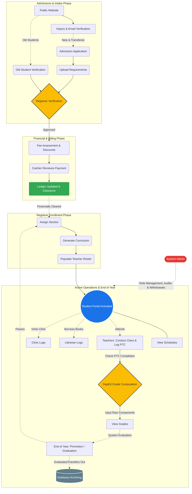
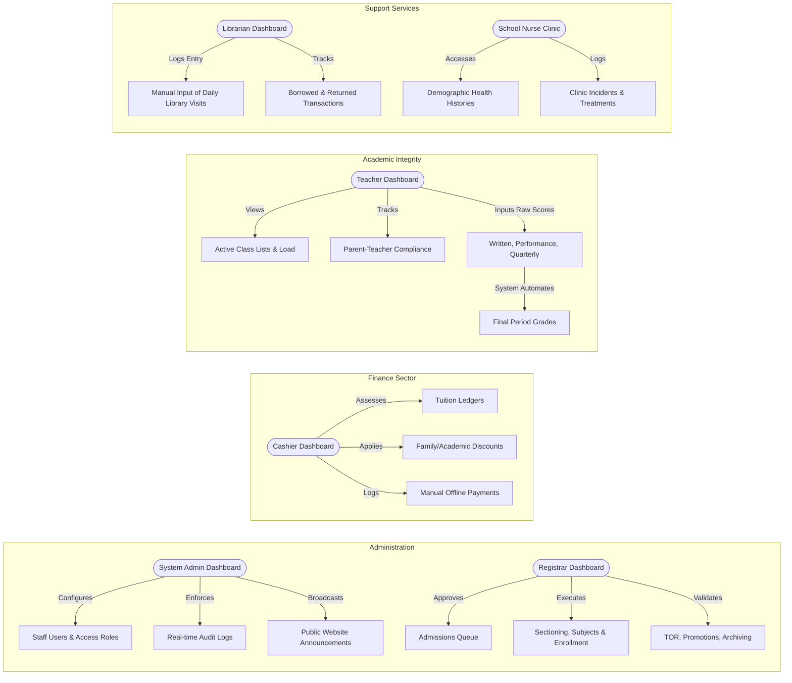
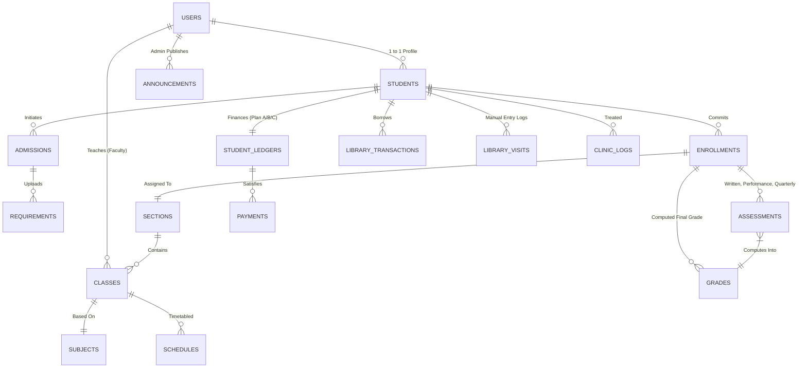

# Master Systems Document
**Agnus Dei School Systems, Inc. - Centralized ERP Project**

This document serves as the formal architectural and operational blueprint for the Agnus Dei ERP System. It is structured to provide clear requirements for your Capstone defense.

---

## I. Institutional Identity & Core Values

### School Vision
Capacitating the youth to develop the 21st Century skills with the fusion of character formation and intellectual integrity to meet the challenges ahead.

### School Mission
The School commits its resources, time, and best efforts of the Administration, faculty, and staff to provide affordable good quality education, to develop strong Christian faith, and to make the curriculum instructions timelier, and more relevant in order to deepen the civic and spiritual consciousness of every learner.

### Goals and Objectives
1. To provide the basic knowledge and foundation in developing the cognitive, effective, and psychomotor skills, attitudes, and values, including their moral and spiritual dimensions essential to the child's personal development and necessary for living and contributing to a developing and changing social environment.
2. To provide the learning experiences that enhance the child's awareness of and responsiveness to the changes in society and to prepare for constructive and effective involvement.
3. To promote and intensify the child's knowledge of identification with and love for country and people to which he belongs.
4. To develop the child's knowledge, love, and care for the environment.
5. To develop his awareness of the interconnectivity of peoples around the world and their living together in one wide world, thereby creating in the child the tolerance of cultural diversity and the strong desire to contribute to this world's development.
6. To promote work experiences which develop and enhance the child's orientation to the world of work and creativity in order to prepare him to engage in honest and gainful work.
7. To enhance his mastery in the use of tools and technology and his aptitude to innovate as a means of increasing his productivity.
8. To develop the child's different aptitudes, interests, and skills to prepare him for real work and/or for further formal studies in higher education.
9. To help the child realize that in the pursuit of education he seeks to glorify and serve GOD.
10. To contribute to the evangelization efforts of the Church.

### Core Values (RISE UP)
* **R** - esiliency and Adaptability
* **I** - industry and Integrity
* **S** - ocial Transformation
* **E** - mpathy and Emotional Intelligence
* **U** - pskilling and reskilling 
* **P** - roactive Orientation

### 21st Century Skills (The 8 C's)
* Critical Thinking
* Collaboration
* Communication
* Creativity
* Concern for the Environment 
* Computing ICT Literacy
* Career and Learning Self-Reliance 
* Cross Cultural Understanding

---

## II. Institutional Policies, Rules, and Regulations

### A. Admission Policies and Requirements
**1. New Students (from Kinder to Senior HS)**
* **1.1 AGE**
  * 1.1.1. Kinder 1 - 4 years old by the opening of the school year 
  * 1.1.2. Kinder 2 - 5 years old by the opening of the school year 
  * 1.1.3. Grade 1 - 6 years old by the opening of the school year 
* **1.2 Certification:** Certification from the Kindergarten school last attended (for entering Grade 1). All other entrants to Grade 1 who came from other schools shall undergo a Read-Aloud Exercise and physical initial interview.
* **1.3 Form 138:** Certified true copy of the latest Form 138 (Report Card).
* **1.4 Birth Certificate:** PSA-authenticated (for new enrollees).
* **1.5 Certificate of Good Moral Character:** Duly signed by the Principal of the school last attended.
* **1.6 Pictures:** Two (2) 2x2 colored ID pictures with white background.
* **1.7 Interviews:** Incoming Junior High School students who came from other public/private schools and other transferees shall undergo interviews conducted by the JHS Department Coordinator and/or School Head.
* **1.8 Forms:** Accomplished Student Data Form and Parent Data Form.

**Additional Requirements for SHS Entrants**
* **1.10 JHS Graduates from ESC-Certified Private Schools:** ESC Grant Certificate.
* **1.11 JHS Graduates from Non-ESC-Certified Private Schools:** SHS Voucher.

**2. Old Students**
* **2.1** Form 138 (Report Card)

**B. Admission Procedure**
1. Fill up an application form and submit the same to the teacher-in-charge of admission, together with all other essential documents and requirements.
2. New enrollees and transferees shall be interviewed by the teacher-in-charge of admission for initial assessment. Review of grades in Form 138 shall be undertaken as well.
3. Pay the necessary fees to be officially enrolled.
4. Must attend the orientation activity before the opening of classes to become fully informed of the prevailing policies of the School.

**C. Curriculum Year Level**
Only students with no failing marks and a general average of 75% more are eligible for readmission to the next year level. In some instances, students who do not meet the required general average may be readmitted under academic probation in the school year under the following circumstances:
1. They have taken remedial classes during the preceding summer and have passed the same.
2. They do not have behavioral/disciplinary records.

### B. Academic & Grading Policies

**1. Automated Grading Components (DepEd Standard)**
Academic excellence shall be based on the general average the student got from Written Work, Performance Tasks, and Quarterly Assessment. These three areas are given specific percentage weights that vary according to the nature of the learning area.

**Table 1. Weight of the Components for Grades 1 – 10**
| Components | Languages / AP / ESP | Science / Math | MAPEH / EPP / TLE |
| :--- | :---: | :---: | :---: |
| **Written Work** | 30% | 40% | 40% |
| **Performance Task** | 50% | 40% | 40% |
| **Quarterly Assessment** | 20% | 20% | 20% |

**Table 2. Weight of the Components for SHS (Grades 11 – 12)**
| Components | Core Subjects | Academic Track: All Other Subjects | Academic Track: Work Immersion / Research | TVL / Sports / Arts & Design Track |
| :--- | :---: | :---: | :---: | :---: |
| **Written Work** | 25% | 25% | 35% | 20% |
| **Performance Task** | 50% | 45% | 40% | 60% |
| **Quarterly Assessment** | 25% | 30% | 25% | 20% |

**2. Recognition of Merit / Selection of Honor Students**
* **C.1.** Candidates for honors in all levels shall have no grade lower than 87% in any subject. The top five achievers of each curriculum level will be recognized at the end of each quarter. Rankings for the top five (5) achievers will not be announced until the last quarter of the school term. 
* **C.2.** To qualify for honors, a student must not have any major derogatory record or violate school policies.
* **C.3.** The top five (5) achievers shall be ranked using the **7-3 Point Scheme** (7 points for Academic Performance and 3 points for Co-curricular Activities).
* **C.5.** In the final ranking (Refer to DepEd Order No. 8, s. 2015):
  * **98-100**: Highest Honor
  * **95-97**: High Honor
  * **90-94**: With Honor

### C. Financial Policies
It is deemed that once a student is enrolled, a commitment is made for the whole school year. 

**1. Schedule of Payments**
* **Plan A (Cash):** All fees are paid upon enrollment. A ten (10%) percent discount in tuition fees is granted.
* **Plan B (Monthly):** Upon enrollment, Php 1,500 + registration and miscellaneous fees. The balance is divided into months and must be fully settled before the end of the school year.
* **Plan C (Alternative Plan):** Crafted via a meeting with the parent, cashier, and registrar due to unforeseeable circumstances affecting regular payment.

**2. Withdrawal and Refunds**
A student withdrawing after the fourth week of classes will be charged the tuition fees for the entire school year. No official clearance will be released unless accounts are paid. Refunds are based on:
* Before the first week of classes: 100%
* After a week of classes: 90%
* After the second week of classes: 80% 
* After the third week of classes: 70%
* After the fourth week of classes: 0% *(There are no refunds under Plan B).*

> **System note (2026-08-06):** The live `payment_plan` field is a VARCHAR with values `installment|full` (the "Plan A/B/C" labels above are policy documentation, not DB enums). Plan A cash = `full`, Plan B monthly = `installment`; Plan C is handled manually via cashier/registrar agreement.

**3. Scholarships and Privileges & Discount**
* **Honors Program:** Grade 6 Rank 1 receives **100% discount**, Rank 2 receives **50% discount**, Rank 3 receives **25% discount**. JHS Students (Grades 7 to 10): Rank 1 (**100%**), Rank 2 (**75%**), Rank 3 (**50%**).
* **Family Discount:** Enrolling multiple children grants a 10% discount to the second child, and a 15% discount to the third child.
* **ESC Grant:** Php 9,000 for qualifying Grade 7 students, released at the latter part of the term (not applicable at enrollment).

---

## III. System Architecture & Security Standards

To ensure the system is secure and compliant with institutional rules and the **Data Privacy Act of 2012 (RA 10173)**, the following technical constraints are enforced:

* **Scope Control (Offline Ledger):** The ERP restricts payment processing exclusively to physical, face-to-face transactions per the Financial Policies. The system securely acts as a digital ledger.
* **Unified Account Proxy:** Students and Parents share a single, unified Portal Account to simplify access and track the monthly financial statements (Plan B).
* **Password Hashing:** All system passwords are computationally hashed using Laravel’s Bcrypt algorithm.
* **Middleware Routing:** Strict Role-Based Access Control (RBAC) ensures isolated dashboard views.
* **Data Archiving:** Sensitive demographics and medical logs are securely retained rather than permanently deleted, fulfilling legal data retention policies.

---

## IV. Core Operational Workflow (Step-by-Step)

### Phase 1: Pre-Admission & Inquiry
1. **Public Engagement:** Prospective students explore programs, admission policies, and view **Public Announcements** published by the Admin.
2. **Student Number Generation:** Upon identity verification, the applicant receives a strict Institutional Student Number (`[EnrollmentYear]-[UniqueID]`, e.g., `2026-00123`). 

### Phase 2: Application Phase
3. **Admission Application:** The applicant completes their primary profile, fulfilling all age requirements (e.g., K1 = 4 years old).
4. **Requirements Upload:** Secure digital uploading of Birth Certificates, Form 138, and Good Moral profiles.
5. **Registrar Approval:** The Registrar verifies submitted documents. Automated email notifications clear the student for the Finance gate.

### Phase 3: Financial & Enrollment Phase
6. **Tuition Assessment:** The system computes the grade-level fee, prompting the user for **Plan A, Plan B, or Plan C**, and automatically applying honors or family discounts.
7. **Payment Processing:** The Cashier logs the physical payment. This triggers an automated digital receipt and flags the student as "Financially Cleared."
8. **Enrollment & Sectioning:** The Registrar officially categorizes the student: assigning sections and required curriculum subjects.

### Phase 4: Active Student Ecosystem
9. **Portal Activation:** The unified Student/Parent account unlocks to view Class Schedules, monitor pending balances, and track academic grades.

### Phase 5: End of Term & Progression
10. **Promotion Processing:** Upon checking constraints (no failing marks, >75% GWA), students are staged for promotion. The **7-3 Point Scheme** evaluates the top achievers.
11. **Graduation Clearance:** Automated clearance checks against the Cashier and Librarian ledgers ensure no "Back Accounts" exist. 

### 🗺️ Full Operational Flowchart

```mermaid
flowchart TD
    %% Initial Entry
    subgraph Admissions [Admissions & Intake Phase]
        direction TB
        Web[Public Website]
        Inq[Inquiry & Email Verification]
        NewApp(Admission Application)
        Uploads(Upload Requirements)
        OldApp(Old Student Verification)
        RegAuth{Registrar Verification}

        Web --> Inq
        Inq -.->|New & Transferee| NewApp
        NewApp --> Uploads
        Uploads --> RegAuth
        
        Web -.->|Old Students| OldApp
        OldApp --> RegAuth
    end

    %% Payment & Clearances
    subgraph Finance [Financial & Billing Phase]
        direction TB
        Asses(Fee Assessment & Discounts)
        Pay(Cashier Receives Payment)
        Ledg(Ledger Updated & Clearance)
        
        RegAuth -->|Approved| Asses
        Asses --> Pay
        Pay --> Ledg
    end

    %% Enrollment & Classes
    subgraph Enrollment [Registrar Enrollment Phase]
        direction TB
        Sectioning(Assign Section)
        SubjAssignment(Generate Curriculum)
        ClassList(Populate Teacher Roster)
        
        Ledg -.->|Financially Cleared| Sectioning
        Sectioning --> SubjAssignment
        SubjAssignment --> ClassList
    end

    %% Student Life / Portal
    subgraph Services [Active Operations & End of Year]
        direction TB
        Portal((Student Portal Activated))
        Schedule[View Schedules]
        Grades[View Grades]
        
        Teach[Teachers: Conduct Class & Log PTC]
        Enc{DepEd Grade Computation}
        
        Lib[Librarian Logs]
        Nurse[Clinic Logs]
        
        Promo[End of Year: Promotion / Graduation]
        Archive[(Database Archiving)]

        ClassList --> Portal
        Portal --- Schedule
        
        Portal -.->|Attends| Teach
        Teach -->|Check PTC Completion| Enc
        Enc -->|Input Raw Components| Grades
        
        Portal -.->|Borrows Books| Lib
        Portal -.->|Visits Clinic| Nurse
        
        Grades -.->|System Evaluation| Promo
        Promo -.->|Passes| Sectioning
        Promo -.->|Graduates/Transfers Out| Archive
    end
    
    %% Admin Overview
    Admin([System Admin]) -.-> |Role Management, Audits & Withdrawals| Services

    %% Add some color styling for readability
    classDef portal fill:#1a73e8,stroke:#fff,stroke-width:3px,color:#fff;
    classDef gate fill:#fbbc04,stroke:#333,stroke-width:2px;
    classDef auth fill:#34a853,stroke:#fff,stroke-width:2px,color:#fff;
    classDef admin fill:#e53935,stroke:#fff,stroke-width:2px,color:#fff;
    classDef archive fill:#607d8b,stroke:#fff,stroke-width:2px,color:#fff;
    
    class Portal portal;
    class Enc gate;
    class RegAuth gate;
    class Ledg auth;
    class Admin admin;
    class Archive archive;
```

---

## V. Cross-Functional Process Flows

* **Old Student Registration:** Returning students bypass document uploads. They input their legacy LRN, update contact info, and await evaluation for legacy holds before proceeding to Payment.
* **Cashier Process:** Applies Plan A/B/C payment terms, evaluates manual discounts, inputs over-the-counter payments and automatically blocks non-paying students (Back Accounts) from taking the Monthly/Periodical tests.
* **Teacher Process:** Teachers instruct students and log PTC compliance. When grading opens, Teachers input raw scores based on four assessment types (**Written Work, Quiz, Seatwork, Exam**). Grade finalization is blocked for students flagged as non-PTC compliant or those holding Back Accounts.
* **Librarian Process:** The Librarian **manually inputs** a student's institutional Student Number to log their daily facility usage and to trace borrowed books.
* **School Nurse Process:** Access demographic profiles to log clinic incident dates, symptoms, and provided treatments.
* **System Admin Process:** Creates users, enforces access roles, captures audit trails, and publishes **Announcements.**

---

## VI. Role-Based Dashboards (RBAC Specific Views)

The ERP enforces strict Role-Based Access Control (RBAC) via Laravel Middleware:

### 1. System Admin Dashboard
* **Website Management:** Toggles to draft and publish Announcements directly to the Public Website.
* **Global Controls:** Toggles for sweeping academic events.
* **Staff Account Management:** Create, edit, toggle active/inactive, and reset passwords for all institutional staff including teachers, registrars, cashiers, librarians, nurses, directress, and principal. When creating a Teacher account, a corresponding Teacher profile record is automatically created.
* **Student Account Management:** View, toggle active/inactive, and reset passwords for student accounts.
* **Audit Trails:** Real-time stream tracking system modifications.

### 2. Registrar Dashboard
* **Admissions Queue:** Tool for reviewing New/Old applications and verifying document legality (Age rules, ESC Grants).
* **Curriculum & Sectioning:** Formally enroll financially-cleared students and map transferee subjects.
* **Master Records:** Process year-end promotions based on 75% GWA, compute the **7-3 Point Scheme** for honors, and process student withdrawals.

### 3. Cashier Dashboard
* **Assessment & Adjustments:** Define tuition brackets and apply systemic/manual academic/sibling discounts (Honors Program 25% - 100%).
* **Offline Payment Terminal:** Log physical cash payments directly against a student's profile to issue digital receipts under the Plan A/B/C terms.
* **Organizational Ledger:** Track aggregate pending balances and flag students with "Back Accounts" to block examinations.

### 4. Teacher Dashboard
* **Workload & Roster View:** Instantly access active Class Lists explicitly defined by the Registrar.
* **Automated Component Grading Portal:** Allows teachers to input granular, raw assessment scores specifically categorized as **Written Work, Quiz, Seatwork, and Exam**. The dashboard instantly computes the final grade based on weighted components: Written Work 20%, Quiz 20%, Seatwork 20%, Exam 40%.
* **Compliance Checks:** Interface to log PTC attendance. Non-compliant students cannot be graded.

### 5. Unified Student/Parent Dashboard
* **Academic Interface:** Visual timetable of classes.
* **Report Card Interface:** View finalized, computed academic grades representing DepEd standard grading.
* **Ledger Interface:** Track the student's compliance with their chosen Payment Plan (A, B, or C).

### 6. Librarian Dashboard
* **Facility Log & Circulation Desk:** Interface designed for **manual input** of Student Numbers to securely log daily visits and checkout books.

### 7. School Nurse Dashboard
* **Clinic Interface:** Access student/staff demographics to digitally record clinic visits and symptoms.

### 8. Directress Dashboard
* **Fee Schedule Management:** Full CRUD for grade-level, term, and school-year fee configurations (Kinder through Grade 12, 3 terms per school year).
* **Graduation Fee Management:** Full CRUD for Grade 6, 10, and 12 graduation fees with student assignment and paid status toggling.

### 9. Principal Dashboard
* **Schedule Management:** Add, view, and delete class schedules per grade level with conflict detection for teacher time slots.
* **Grade Viewing:** Read-only access to student grades across all subjects, sections, and school years.
* **Announcements:** Full CRUD for school-wide announcements and events with published/draft states.

### 👤 Dashboard Capabilities Flowchart

```mermaid
flowchart LR
    subgraph Administration
        Admin([System Admin Dashboard]) --> |Configures| Users[Staff Users & Access Roles]
        Admin --> |Enforces| Security[Real-time Audit Logs]
        Admin --> |Broadcasts| Announcements[Public Website Announcements]
        
        Reg([Registrar Dashboard]) --> |Approves| Applications[Admissions Queue]
        Reg --> |Executes| Curric[Sectioning, Subjects & Enrollment]
        Reg --> |Validates| Records[TOR, Promotions, Archiving]
    end

    subgraph Finance Sector
    direction LR
        Cash([Cashier Dashboard]) --> |Assesses| Fees[Tuition Ledgers]
        Cash --> |Applies| Disc[Family/Academic Discounts]
        Cash --> |Logs| Pay[Manual Offline Payments]
    end

    subgraph Academic Integrity
        Teach([Teacher Dashboard]) --> |Views| Roster[Active Class Lists & Load]
        Teach --> |Tracks| PTC[Parent-Teacher Compliance]
        Teach --> |Inputs Raw Scores| Assess[Written, Performance, Quarterly]
        Assess --> |System Automates| Final[Final Period Grades]
    end

    subgraph Support Services
        Lib([Librarian Dashboard]) --> |Logs Entry| Entry[Manual Input of Daily Library Visits]
        Lib --> |Tracks| Books[Borrowed & Returned Transactions]
        
        Nurse([School Nurse Clinic]) --> |Accesses| Health[Demographic Health Histories]
        Nurse --> |Logs| Incidents[Clinic Incidents & Treatments]
    end
```
---

## VII. Technical Database Architecture (Laravel / MySQL)

### Database Schema Map
* **Core Access:** `users`, `roles`
* **Student Records:** `students`, `admissions`, `requirements`
* **Financials:** `fee_schedules`, `student_ledgers` (payment plan types), `payments`
* **Academics:** `subjects`, `sections`, `classes`, `schedules`, `enrollments`
* **Assessments & Support:** `assessments` (raw scores categorized as Written, Performance, Quarterly), `grades` (computed term averages), `library_transactions`, `library_visits`, `clinic_logs`, `activity_logs`, `announcements`

### Entity-Relationship Diagram (ERD)

```mermaid
erDiagram
    USERS ||--o{ STUDENTS : "1 to 1 Profile"
    USERS ||--o{ CLASSES : "Teaches (Faculty)"
    USERS ||--o{ ANNOUNCEMENTS : "Admin Publishes"
    
    STUDENTS ||--o{ ADMISSIONS : "Initiates"
    ADMISSIONS ||--o{ REQUIREMENTS : "Uploads"
    
    STUDENTS ||--o{ ENROLLMENTS : "Commits"
    ENROLLMENTS ||--|| SECTIONS : "Assigned To"
    SECTIONS ||--o{ CLASSES : "Contains"
    CLASSES ||--|| SUBJECTS : "Based On"
    CLASSES ||--o{ SCHEDULES : "Timetabled"
    
    ENROLLMENTS ||--o{ ASSESSMENTS : "Written, Performance, Quarterly"
    ENROLLMENTS ||--o{ GRADES : "Computed Final Grade"
    ASSESSMENTS }|--|| GRADES : "Computes Into"

    STUDENTS ||--|| STUDENT_LEDGERS : "Finances (Plan A/B/C)"
    STUDENT_LEDGERS ||--o{ PAYMENTS : "Satisfies"
    
    STUDENTS ||--o{ LIBRARY_TRANSACTIONS : "Borrows"
    STUDENTS ||--o{ LIBRARY_VISITS : "Manual Entry Logs"
    STUDENTS ||--o{ CLINIC_LOGS : "Treated"
```

---

## VIII. Known Issues and Bug Fixes

The following issues were identified during testing and have been resolved:

### Bug 1: Admission Step 4 (Family Background) Green Checkmark Error

**Issue:** Step 4 (Family Background) in the multi-step admission form always displayed a green checkmark even when no data was entered. This occurred because the `isStepComplete()` function had an empty required fields array for step 4 (`4: []`), and the function returned `true` when the array was empty — treating "no required fields" as "all required fields satisfied."

**Root Cause:** In `resources/views/portal/student/admission-apply.blade.php`, the `isStepComplete(n)` function at line 413 contained:
```javascript
4: [],
// ...
if (fields.length === 0) return true;
```

**Fix:** Changed the logic so that steps with an empty required fields array return `false` instead of `true`. This ensures that a step is only marked complete when its required fields are actually filled in.

**File:** `resources/views/portal/student/admission-apply.blade.php` — `isStepComplete()` function.

---

### Bug 2: Duplicate First-Login Password Change Prompts

**Issue:** Users were presented with two separate password change prompts upon first login: (1) a full-screen blocking modal overlay on the portal dashboard, and (2) a standalone page accessible at `/force-change-password`. Both forms submitted to the same `password.force.update` route, creating confusion and a redundant user experience.

**Root Cause:** The system implemented the first-login password change in two places:
1. A Blade modal partial (`portal/partials/force-change-password-modal.blade.php`) included in the portal layout (`portal/layouts/app.blade.php` at line 481), which renders as a full-screen overlay when `auth()->user()->first_login_at` is `NULL`.
2. A standalone Blade page (`auth/force-change-password.blade.php`) accessible via `GET /force-change-password` route, defined in `routes/auth.php` at line 58.

Both forms used the same PUT endpoint (`password.force.update`), but the standalone page was redundant since the modal already handled the password change inline.

**Fix:** Removed the standalone `force-change-password.blade.php` page and its corresponding GET route. The modal overlay in the portal layout is now the sole mechanism for first-login password changes. The PUT route and controller method were retained for the modal form submission.

**Files Modified:**
- `resources/views/auth/force-change-password.blade.php` — removed (or archived)
- `routes/auth.php` — removed the `GET force-change-password` route (line 58-59)
- `resources/views/portal/layouts/app.blade.php` — unchanged (modal remains at line 481)

---

### Bug 3: No Validation on Step Navigation

**Issue:** Users could navigate between admission form steps without filling in required fields. Clicking the "Next" button would advance to the next step even when mandatory fields on the current step were empty. The step indicator would also incorrectly show steps as completed.

**Root Cause:** The `goTo(n)` function in the Alpine.js `admissionForm()` component used DOM-based validation by querying `[required]` elements within the current step's `data-step` container. However, the validation logic had two problems:
1. It only checked elements with the HTML `required` attribute, but some fields relied on Alpine.js `x-bind:required` (dynamic required) which may not have been evaluated at DOM query time.
2. The visual error highlighting (adding `border-red-500` and `bg-red-50` classes) was applied, but there was no user-facing error message or toast notification explaining what was wrong.

**Fix:** Enhanced the `goTo(n)` function to:
1. Check all input, select, and textarea elements within the current step, regardless of `required` attribute status, to ensure fields are not left empty.
2. Add a visible error message at the top of the form when validation fails, indicating which step has incomplete fields.
3. Scroll the error message into view so the user sees it immediately.

**File:** `resources/views/portal/student/admission-apply.blade.php` — `goTo()` and `submitAll()` functions.

---

### Bug 4: Missing Input Validation on Form Submission

**Issue:** Users could click the "Next" or "Submit Application" buttons without filling in all required textboxes. The system did not prevent navigation or submission when fields were empty, leading to incomplete data being saved or submitted.

**Root Cause:** The form relied on native HTML5 `required` attributes for validation, but Alpine.js-controlled forms can bypass native validation when using `@click` handlers with `this.step = n` assignments. The `goTo()` function checked for empty values but did not provide clear feedback, and the `submitAll()` function only validated fields with the `required` attribute — missing fields that were conditionally required (e.g., SHS Strand when Grade 11 or 12 is selected).

**Fix:** Added comprehensive client-side validation that:
1. Checks all visible input, select, and textarea fields in the current step before allowing navigation.
2. Highlights empty fields with a red border and background.
3. Displays a transient error message ("Please fill in all required fields before proceeding.") at the top of the form.
4. Prevents form submission if any step has incomplete fields, navigating to the first step with errors.
5. Validates conditional fields (e.g., Strand is required only when Grade Level is Grade 11 or 12).

**File:** `resources/views/portal/student/admission-apply.blade.php` — `goTo()`, `next()`, and `submitAll()` functions.

---

## IX. Requirements Analysis

The developed school information and enrollment management system is composed of public-facing pages, secure authentication, and role-based portals for students, teachers, parents, registrar staff, cashier staff, and administrators. Based on the current implementation, the system now includes expanded controls for admissions verification, tuition and payment handling, academic scheduling, grading, announcements, audit logging, and academic event toggles.

### System-Wide Technical Constraints

The system enforces a global session idle timeout of 30 minutes, after which any inactive user is automatically logged out and must re-authenticate. All passwords must be at least 8 characters long and must contain at least one uppercase letter, one lowercase letter, one number, and one special character. Institutional emails are restricted to the `@agnusdei.edu.ph` domain only. File uploads across all modules are capped at 5 MB per file and restricted to PDF, JPG, JPEG, and PNG formats. The system uses the Asia/Manila timezone (UTC+8) for all timestamp operations, displays currency in Philippine Peso (₱) with two decimal places, and follows the ISO 8601 date format (YYYY-MM-DD). Only one active session is permitted per user account at any time — a new login automatically invalidates the previous session. The system supports Chrome 90+, Firefox 88+, Edge 90+, and Safari 14+ as minimum browser versions.

### 1. Promotional Website Module

The Promotional Website Module serves as the school's online information portal and first point of engagement for visitors. It provides 14 pages including the home page (with published announcements and events), vision, mission, identity, educational philosophy, institutional background, academics, program offerings, admissions, requirements and procedures, discounts and privileges, and contact information. The inquiry system collects first name, last name, and personal email (restricted to Gmail, Yahoo, Proton, Outlook, and Hotmail). The system automatically generates an institutional email (`firstname.lastname@agnusdei.edu.ph`) and a random 8-character alphanumeric password, creates a User and Student record with `pre-admission` status, and sends credentials via email. Rate limiting is applied to prevent abuse.

Inquiry submissions are limited to 5 per IP address per hour and 3 per email address per day, with a 1-hour lockout after exceeding the limit. First and last name fields are each capped at 100 characters. The home page displays a maximum of 10 most recent published announcements and 5 upcoming events. Duplicate submissions from the same personal email are rejected to prevent duplicate account creation. Auto-generated passwords are exactly 8 alphanumeric characters and cannot be customized during the inquiry process. The module does not support inquiry tracking, follow-up scheduling, or admin-side inquiry management beyond account creation.

### 2. Authentication Module

The Authentication Module manages secure access to the system through authentication. It supports login, logout, forgot password, and reset password flows. Users authenticate using their institutional email and password. The system tracks last and first login timestamps. Self-registration is disabled since accounts are created exclusively through the inquiry flow for students or admin/directress action for staff. Upon first login, a floating modal blocks all interaction until the user changes their default password. Profile management allows users to edit their first name, last name, contact number, and profile picture. Active/inactive account status prevents login for deactivated accounts.

A maximum of 5 consecutive failed login attempts triggers a 15-minute account lockout, though an Admin can manually unlock it sooner. Password reset requests are limited to 3 per email address per hour, with reset tokens expiring after 60 minutes. The system prevents password reuse by checking against the last 3 passwords. Account deletion is soft-delete only — records are retained for audit trail purposes. Deactivated accounts receive a generic "Invalid credentials" message to avoid disclosing account status. First-login password change is mandatory and cannot be dismissed without completion. The module does not support two-factor authentication, biometric login, social media authentication, or single sign-on (SSO).

### 3. Role-Based Access Control Module

The Role-Based Access Control Module ensures users only access features appropriate to their role. The system supports exactly 9 roles: Admin, Registrar, Cashier, Teacher, Librarian, Nurse, Student, Principal, and Directress. Each user is assigned exactly 1 role. Route groupings and role-specific dashboards are enforced through Laravel middleware. A first-login welcome banner is shown on each role's dashboard and can be dismissed.

Multi-role assignments are not supported — each user holds exactly one role at all times. Role assignments can only be performed by an Admin. Unauthorized access attempts return a 403 Forbidden error via middleware enforcement. Each role has a dedicated dashboard with no cross-role visibility. The welcome banner can be dismissed once per session per device. An Admin cannot demote their own account. The module does not support custom role creation, role hierarchies, permission granularity beyond the 9 predefined roles, or temporary role assignments with expiration dates.

### 4. System Administration Module

The System Administration Module provides school-wide management. Administrators can create, edit, and manage staff accounts with auto-generated temporary passwords, toggle active/inactive status, and reset passwords. The pending account confirmations page allows batch or individual confirmation of student ledger accounts. School settings include active school year, directress name, and principal name. The audit logs page provides filtered activity trail viewing by user, event type, date range, and text search. The admin dashboard displays pending confirmations, total users, active roles, and recent activity. Student promotion supports promote, retain, graduate, and transfer actions with automatic fee carry-over. CSV exports for enrollments, grades, and collections are also accessible from the admin module.

Staff account creation is limited to one account at a time. Auto-generated temporary passwords are exactly 8 characters. The pending confirmations page displays 20 entries per page with pagination. The active school year follows the format YYYY-YYYY, with only one active school year permitted at a time. Audit logs return a maximum of 500 entries per query and are retained for 1 year from the event date. CSV exports are capped at 10,000 rows per export. An Admin cannot deactivate their own account, and school settings are editable by Admin only. Fee carry-over saves unpaid balances as `carried_over_balance` and adds them to the new term's total assessed amount. The module does not support bulk staff creation, custom audit log retention periods, automated backups, or system-wide configuration exports.

### 5. Directress Module

The Directress Module manages fee structures, graduation fees, and teacher accounts. Fee schedule management provides full CRUD for grade-level, term, and school-year fee configurations covering Kinder through Grade 12 with 3 terms per school year. Graduation fee management covers Grade 6, Grade 10, and Grade 12 with CRUD operations, student assignment, and paid status toggling. Teacher management includes full CRUD with auto-generated passwords and password reset capability. The dashboard displays real-time counts of teachers, fee schedules, and graduation fees.

Fee schedules cover 14 grade levels maximum (Kinder through Grade 12) with 3 terms per school year. Each fee schedule is unique per grade level, term, and school year combination — duplicate entries for the same combination are rejected. Fee amounts range from ₱0.00 to ₱100,000.00. Graduation fees are restricted to Grade 6, Grade 10, and Grade 12 only (3 grade levels), with amounts ranging from ₱0.00 to ₱5,000.00. Each graduation fee is unique per grade level and school year, and the maximum students per graduation fee is limited by the enrollment count for that grade level. Teacher auto-generated passwords are exactly 8 characters. Teacher account creation and all fee management operations are restricted to the Directress role only. The module does not support fee schedule templates, bulk fee uploads, historical fee comparison reports, or fee approval workflows.

### 6. Principal Module

The Principal Module provides academic oversight through schedule management, grade viewing, and announcements. The principal can add, view, and delete class schedules per grade level with conflict detection for teacher time slots. Grade viewing is read-only across all subjects, sections, and school years. Announcements have full CRUD with title, content, type (announcement/event), date, and published/draft states. The dashboard displays real-time announcement count, section count, student count, and recent announcements.

Schedule conflict detection is enforced — the system prevents scheduling a teacher in two overlapping time slots on the same day. Grade viewing is strictly read-only; the Principal cannot edit or input grades. Announcement titles are capped at 200 characters, and content at 5,000 characters. Only 2 announcement types are supported (`announcement` and `event`) with 2 states (`published` and `draft`). The date field is required and cannot be a past date for events. A maximum of 10 most recent published announcements are displayed on the public homepage, while drafts are visible only on the Principal's dashboard. Schedule deletion requires confirmation. The module does not support schedule template creation, grade input or modification, bulk announcement publishing, or announcement scheduling for future release dates.

### 7. Student Portal Module

The Student Portal Module is the main operational area for student users. It provides a dashboard showing active enrollment, pending admission, and ledger status. The module includes a multi-step admission application with draft persistence, admission status tracking, document upload for requirements, enrollment application for returning students, withdrawal requests, report card viewing, Certificate of Registration (COR), class schedule grid, and statement of account (ledger). Sidebar links are conditionally displayed based on the student's current status.

Only 1 active draft is permitted per student at any time, and drafts can be resumed or discarded but not partially saved. Document upload allows 1 file per document type per admission, with a maximum file size of 5 MB and restricted to PDF, JPG, JPEG, and PNG formats. Sidebar links are conditionally displayed: new applicants see "Apply for Admission," students with a student number but no enrollment see "Enroll Now," and fully enrolled students see all portal links. Withdrawal requests are limited to 1 pending request per student at a time. Report card, COR, and schedule grid access is restricted to enrolled students only. Application numbers follow the format `ADM-YYYY-XXXXX` with a maximum of 99,999 per year. The module does not support parent portal access, notification preferences, chat functionality, or mobile-responsive design optimization.

### 8. Admission Management Module

The Admission Management Module handles student application intake and verification. It features a 6-step multi-step admission form with draft saving: (1) Application Details — type (New, Old, Transferee), grade level, strand for SHS, school year; (2) Personal Information; (3) Address; (4) Family Background; (5) Emergency Contact; (6) Previous School. Drafts can be resumed or discarded. Application numbers follow the format `ADM-YYYY-XXXXX`. The system tracks status through Pending, Verified, Approved By Registrar, and Rejected states. Registrars verify requirements, assign sections and subjects, and approve applications with automatic student number generation.

The admission form consists of exactly 6 steps that cannot be skipped. Application types are limited to 3: New, Old, and Transferee. Strand selection is required for SHS applicants (Grade 11–12) only. Application numbers follow `ADM-YYYY-XXXXX` format with a maximum of 99,999 per year. The status flow is linear (Pending → Verified → Approved/Rejected) with no backwards movement permitted. Only 1 active draft per student is allowed. Draft retention persists until submitted, discarded, or superseded by a new inquiry. Rejection allows optional remarks (maximum 500 characters). Duplicate applications are rejected if the student has a pending or approved application. Age validation is enforced per school policy. Section and subject assignments are Registrar-only and required for approval. The module does not support application fee payment, interview scheduling, entrance examination scoring, or applicant queue management with priority levels.

### 9. Requirements Tracking and Document Submission Module

The Requirements Module manages documentary compliance for admissions. It tracks three document types: PSA Birth Certificate, Form 138 (Report Card), and Good Moral Certificate. Files are stored as PostgreSQL BYTEA (binary) directly in the database, with metadata including original filename, MIME type, and file size. Upload validation restricts to PDF, JPG, JPEG, and PNG formats up to 5 MB per file. Students upload through their admission status page, and registrars verify individually or all at once.

Exactly 3 document types are tracked — no additional document types can be added without system modification. Maximum file size is 5 MB per file, restricted to PDF, JPG, JPEG, and PNG formats. Only 1 file per document type per admission is allowed — uploading a new file replaces the previous one. File downloads are restricted to registrars only; students can view metadata but not download files. Verification states are Pending, Verified, or Rejected, with optional rejection remarks (maximum 500 characters). Document uploads are not reused across admissions — each new admission requires fresh uploads. The module does not support document versioning, upload history tracking, bulk document verification, or automated document validation (e.g., OCR extraction of birth certificate data).

### 10. Student Profile Module

The Student Profile Module stores official student records including student number, LRN, personal information, grade level, section, school year, and status. Student numbers follow the format `YYYY-XXXXX` and are auto-generated using PostgreSQL advisory locks when the registrar approves an admission. Status management handles pre-admission, enrolled, archived, and graduated states. Additional fields include scholarship status, parent/guardian information, emergency contacts, previous school details, and archive tracking with reason and timestamp. The profile is automatically created during the inquiry flow with `pre-admission` status and updated as the student progresses through admission and enrollment.

Student numbers follow `YYYY-XXXXX` format with a maximum of 99,999 per year. PostgreSQL advisory locks prevent duplicate student numbers even under concurrent access. LRN must be exactly 12 digits. Status management is limited to exactly 4 states: pre-admission, enrolled, archived, and graduated, with transitions flowing from pre-admission → enrolled → archived or graduated. Profile editing is limited: students can edit limited fields, while Registrar and Admin have full edit authority. Archive records are soft-deleted and retained permanently for data retention compliance. The module does not support student photo uploads, medical record fields, behavioral record tracking, alumni status management, or student data migration from external systems.

### 11. Financial Management Module

The Financial Management Module handles fee assessment, payment processing, and ledger management. The cashier can search students, view fee schedules by grade level and term, and process payments with automatic discount detection. Four discount types are supported: Honor (10%), Sibling (5%), ESC Grant (full tuition waiver for SHS scholars), and Other. Payment plans support both installment and full payment options. Receipt numbers follow the format `RCP-YYYYMMDD-XXXX` and AR numbers follow `AR-YYYY-XXXX`. A payment success modal displays the amount, student name, and receipt number after each transaction. The cashier can print receipts, view detailed student financial summaries, generate date-range filtered collections reports with AJAX-powered pagination, and export collections to CSV. The discount management page allows updating discount type and amount per student ledger.

Exactly 4 discount types are supported: Honor (fixed at 10%), Sibling (fixed at 5%), ESC Grant (full tuition waiver), and Other (manual amount from ₱0.00 up to the assessed amount). Payment plans are limited to 2 options: installment and full payment. Receipt numbers follow `RCP-YYYYMMDD-XXXX` format and AR numbers follow `AR-YYYY-XXXX` format. Payment processing is limited to physical, face-to-face transactions only — no online payment gateway is integrated. Collections reports support a maximum date range of 1 year per query, with AJAX-powered pagination at 20 records per page. CSV exports are the only supported format. The module does not support automated payment reminders, installment plan configuration, payment gateway integration, check or card payment processing, or refund processing — refunds are handled manually per school policy.

### 12. Academic Administration Module

The Academic Administration Module manages the school's academic infrastructure. Administrators have full CRUD for the subject catalog (categories: Core, Contextualized, Specialized, TVL; grade levels: Kinder through Grade 12 + SHS) and section management (with adviser assignment and protection against deletion when active enrollments exist). Classes are created through the `TeachersClassesSchedulesSeeder` which assigns subjects to teachers with conflict-free scheduling. The Principal manages class schedules with conflict detection. The Directress manages fee schedules (per grade, per term, per school year) and graduation fees (Grade 6, 10, 12 only) with student assignment and paid status toggling.

Subject categories are limited to exactly 4: Core, Contextualized, Specialized, and TVL. Subject grade levels cover Kinder through Grade 12 plus SHS (15 levels maximum). Each subject is unique per name, category, and grade level. Section deletion is blocked when active enrollments exist. Section adviser assignment is required, with one teacher per section. The maximum number of sections per grade level is limited by available teachers and rooms. Class scheduling conflict detection is enforced for teacher time slots. Subject and section CRUD operations are restricted to Admin only, schedule CRUD to Principal only, and fee management to Directress only. The module does not support custom curriculum creation, cross-grade subject enrollment, schedule conflict resolution suggestions, or automated room assignment.

### 13. Academic Grading and Assessment Module

The Academic Grading and Assessment Module manages teacher grade input, assessment tracking, and grading compliance. Teachers have five sub-tabs: (1) Classes — list of assigned classes; (2) Class List — master student list per class; (3) Grade Assessment — enter assessment scores per student per class, per grading period; (4) Computed Grades — auto-computed weighted grades with batch submission; (5) Schedule — weekly schedule view. Assessment types are Written Work, Quiz, Seatwork, and Exam. Grading periods are 1st Term, 2nd Term, and 3rd Term. Computed grades use equal weighting: Written Work 20%, Quiz 20%, Seatwork 20%, Exam 40%. Grade submission sends email notifications to admin and registrar via the `GradesSubmittedMail` mailable. The Principal has read-only access to student grades by grade level, section, and school year.

Assessment types are limited to 4: Written Work (maximum score 50), Quiz (maximum score 30), Seatwork (maximum score 50), and Exam (maximum score 100). Grading periods are limited to 3: 1st Term, 2nd Term, and 3rd Term. The computed grade formula is fixed: `(WW×0.20) + (Quiz×0.20) + (Seatwork×0.20) + (Exam×0.40)`. Once grades are submitted, they cannot be edited by the teacher — an Admin override is required for corrections. Teachers can only access grades for their own assigned classes. Batch submission is supported for computed grades but not for individual assessment entry. The module does not support custom weight configurations, grade curves, class average calculations, grade history comparisons, or automated parent notifications for failing grades.

### 14. Report Cards Module

The Report Cards Module generates, views, and prints student report cards. Registrars can view all active enrollments with search and filtering by grade level, section, and school year. Individual report cards display per-subject grades across three terms with final averages and remarks (Passed if final grade ≥ 75, otherwise Failed). PDF generation uses DomPDF with A4 portrait layout, including the school header, directress name, and principal name from system settings. Students can view their own report cards at `/student/report-card`.

PDF layout is limited to A4 portrait only. The passing grade threshold is hardcoded at 75 — Passed if final grade ≥ 75, otherwise Failed. Each report card covers exactly 3 terms. Report card contents include school header, directress name, principal name, per-subject grades, final average, and remarks. PDF generation uses DomPDF. Student access is restricted to their own report card at `/student/report-card`. Registrar access covers all active enrollments, filterable by grade level, section, and school year. Remarks are generated automatically based on the final average. Report cards are viewable and printable in A4 layout only. The module does not support grade comments, teacher remarks fields, class rank display, honor roll notation, multi-page report cards, or PDF batch generation for all students.

### 15. Student Promotion Module

The Student Promotion Module handles end-of-year student progression. The admin promotion page lists all active enrollments grouped by grade level. Actions per student include: Promote (creates new enrollment in the next grade level with new classes and carried-over balances), Retain (creates new enrollment in the same grade and section), Graduate (sets enrollment status to Graduated and student status to graduated), and Transfer Out (sets enrollment to Withdrawn and student status to archived). Fee carry-over is automatic — unpaid balances are saved as `carried_over_balance` and added to the new term's total assessed amount.

Exactly 4 promotion actions are supported: Promote, Retain, Graduate, and Transfer Out. Promotion authority is restricted to Admin only. Promotion can be processed individually or in bulk per grade level. Graduation is limited to Grade 6, Grade 10, and Grade 12 students only. Transfer Out requires a mandatory archive reason. Promotion history is retained in the database for audit purposes. The system does not automatically determine promotion eligibility — the Admin must manually verify passing grades and school policy compliance before executing promotion actions. Fee carry-over saves unpaid balances as `carried_over_balance` and adds them to the new term's total. The module does not support automatic promotion based on grade thresholds, promotion approval workflows, grade-level capacity limits, or semester-based mid-year promotion.

### 16. Library Management Module

The Library Management Module provides comprehensive library operations. The librarian dashboard displays total books, available quantity, borrowed count, and overdue count. Book management includes full CRUD with title, author, ISBN, serial number, publisher, year published, quantity, price, and active/inactive status. Loan management supports borrowing (student + book + dates + condition assessment), returning (with condition-based fee calculation), and overdue tracking. Fees are automatically calculated on return: late fees at configurable per-day rates (default ₱5.00/day), damage fees for Minor (₱50.00), Major (₱200.00), and Lost (book price), all added to the student's ledger. The library visits module logs student clock-in/out times. Search endpoints support JSON-based search for students, books, and loans with advanced filters.

Book quantity per title is capped at 999. The default loan duration is 7 days (configurable). Late fees default to ₱5.00 per day with no maximum cap — fees accumulate until return. Damage fees are fixed: Minor (₱50.00), Major (₱200.00), and Lost (full book price). All fees are automatically posted to the student's ledger. The default borrowing limit per student is 3 books (configurable). Book availability is calculated as quantity minus currently borrowed copies. Library visits log clock-in/out times only — visit duration and purpose are not tracked. The module does not support inter-library loans, book reservations, digital book lending, barcode/RFID scanning, or catalog export to MARC format.

### 17. School Clinic Module

The School Clinic Module manages clinic visit logging and basic health record management. The nurse dashboard displays today's visits, this week's total, referrals count, follow-ups, and recent logs. The system allows creating clinic logs with student selection, incident date, complaint, diagnosis, treatment, notes, and referral information. Logs are searchable by student name and filterable by incident type and date range. This is an incident logging system only — it does not include medication inventory, appointment scheduling, vital signs tracking, or student health profiles.

Incident dates cannot be a future date. Log creation and editing are restricted to the Nurse role. Logs can be soft-deleted but are retained for audit purposes. Incident types are configurable categories (e.g., injury, illness, emergency) but cannot be added through the user interface — they require system-level configuration. This is an incident logging system only. The module does not support medication inventory, appointment scheduling, vital signs tracking, student health profiles, vaccination records, health report generation, or referral tracking to external medical providers.

### 18. Withdrawal Management Module

The Withdrawal Management Module handles student withdrawal requests and processing. Students submit withdrawal requests with a required reason through the student portal, with prevention of duplicate pending requests. Registrars view all withdrawals with search and status filtering, approve withdrawals (which sets enrollment status to Withdrawn and student status to archived), or reject with optional remarks.

A maximum of 1 pending withdrawal request per student is allowed at a time. The reason field is required with a maximum of 500 characters. Withdrawal statuses are limited to 3: Pending, Approved, or Rejected. Approval sets enrollment to Withdrawn and student status to archived. Rejection allows optional remarks (maximum 500 characters). Approval and rejection authority is restricted to the Registrar role only. After rejection, the student may submit a new withdrawal request. Withdrawal processing is one student at a time — bulk processing is not supported. Withdrawal history is retained in the database for audit purposes. The module does not support automatic refund processing, withdrawal approval workflows with multiple signatories, or withdrawal status notifications to parents.

### 19. Data Export Module

The Data Export Module provides CSV export functionality. The admin dashboard offers three exports: (1) Enrollments — LRN, first name, last name, grade level, section, adviser, status; (2) Grades — LRN, name, grade, section, subject, 1st Term, 2nd Term, 3rd Term, final grade, remarks; (3) Collections — receipt number, student name, LRN, amount, payment date, cashier (current month). The cashier provides an additional date-range filtered collections report export with payment plan breakdown.

Export format is limited to CSV only — Excel, PDF, and other formats are not supported. Maximum export rows are capped at 10,000 per export. For datasets exceeding 10,000 rows, the system exports in paginated chunks. Export filenames follow the format `{type}_{YYYYMMDD}.csv`. Export authority is Admin for enrollments, grades, and collections, and Cashier for collections only. Collections default to current month unless a custom date range is specified. Exports are triggered manually via button click — there is no scheduled or automatic export feature. The module does not support custom field selection, report template customization, scheduled exports, or export history tracking.

### 20. Announcements Module

The Announcements Module manages school-wide announcements and events, managed by the Principal. Two types are supported: `announcement` and `event`. The Principal has full CRUD with title, content, type, date, and published/draft states. Published announcements are displayed on the public homepage.

Exactly 2 announcement types are supported: `announcement` and `event`. Exactly 2 states are supported: `published` and `draft`. Title is required with a maximum length of 200 characters. Content is required with a maximum length of 5,000 characters. The date field is required and cannot be a past date for events. A maximum of 10 most recent published announcements are displayed on the public homepage. Drafts are visible only on the Principal's dashboard. After publication, changes reflect immediately on the public homepage. Announcements are soft-deleted and retained for audit purposes. The module does not support scheduled publishing (auto-publish on a future date), audience targeting (e.g., specific grade levels only), read receipts (tracking who viewed the announcement), or announcement categorization beyond the two predefined types.

### 21. Activity Logging Module

The Activity Logging Module provides audit trail capabilities for monitoring. It tracks subject relationships, causer information, event types, and descriptions. Logging occurs across login/logout events, admission approvals, payment processing, discount updates, book operations, staff account changes, subject/section CRUD, and student promotion actions. The admin audit logs page provides filtered viewing by user, event type, date range, and text search.

Logged event types are limited to: login, logout, admission approval, payment processing, discount update, book operations, staff account changes, subject/section CRUD, and student promotion. The admin audit logs page returns a maximum of 500 entries per query. Audit logs are retained for 1 year from the event date. Log deletion is restricted to Admin only and uses soft delete with an audit trail. Real-time logging is enforced — logs are created at the moment of event occurrence. IP address logging is automatic. Text search covers the description field only. The module does not support log export (view only), bulk log operations, real-time alerts for suspicious activity, or automated log rotation. Log data cannot be modified or tampered with by any user role, ensuring integrity for compliance and security audits.
